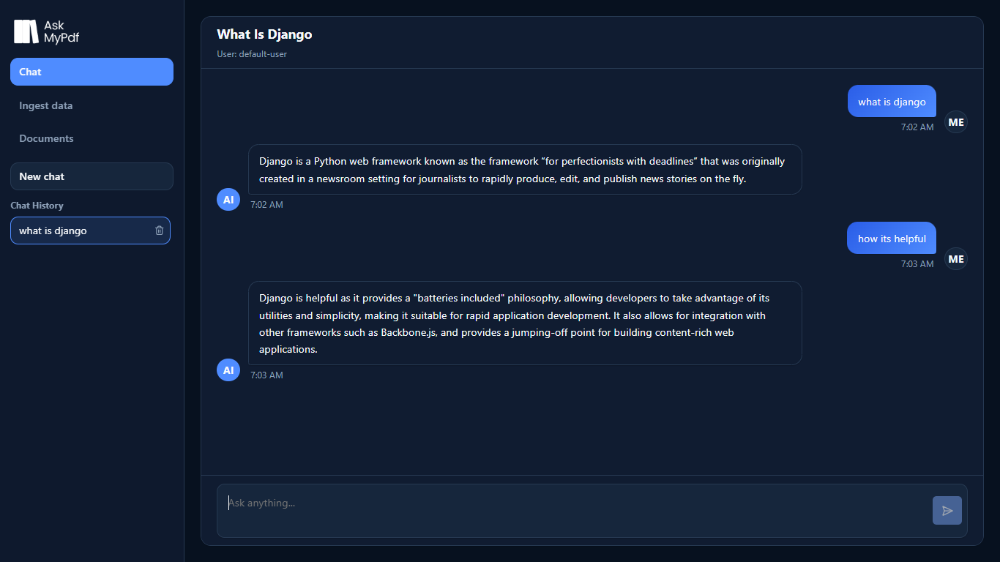
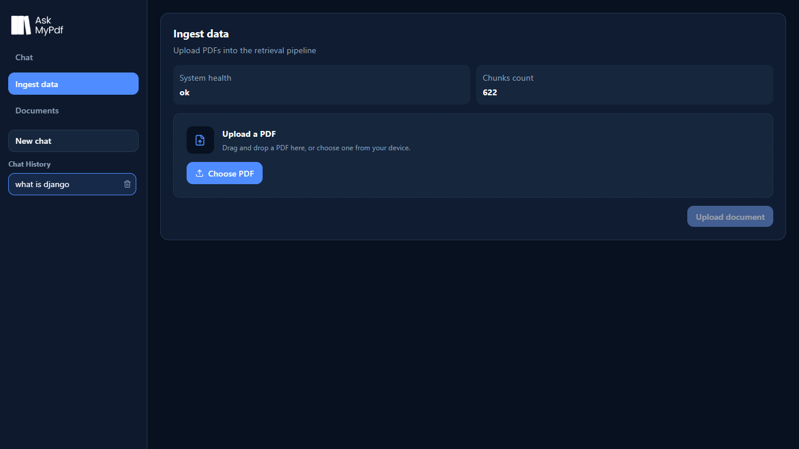
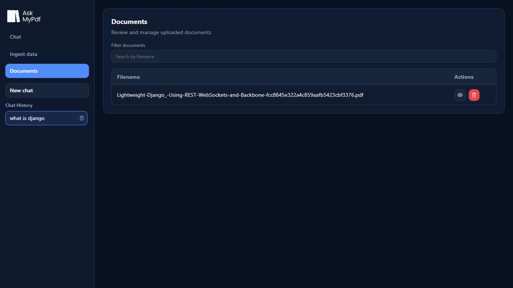

**AskMyPdf** is an AI-powered Retrieval-Augmented Generation (RAG) application that allows users to upload PDF documents and ask natural language questions about their content. Instead of searching manually through long documents, users can chat with their PDFs and receive context-aware answers generated by a Large Language Model (LLM).

The application uses semantic search with vector embeddings to retrieve the most relevant document chunks before generating accurate responses.

---

## ✨ Features

* 📄 Upload PDF document
* 💬 Chat with your PDFs using natural language
* 🧠 Context-aware conversations with chat history
* 🔍 Semantic search using vector embeddings
* ⚡ FastAPI backend for high performance
* ⚛️ React frontend with modern UI
* 🗂️ ChromaDB vector database
* 🤖 LLM-powered answer generation
* 🗑️ Delete uploaded PDFs
* 📜 Chat history with multiple conversations
* 🎨 Clean and responsive interface

---

## 🏗️ Architecture

```text
                ┌───────────────────┐
                │   React Frontend  │
                └─────────┬─────────┘
                          │
                     REST API
                          │
                ┌─────────▼─────────┐
                │ FastAPI Backend   │
                └─────────┬─────────┘
                          │
        ┌─────────────────┼─────────────────┐
        │                 │                 │
        ▼                 ▼                 ▼
 PDF Loader      Text Splitter      Chat Memory
        │                 │
        ▼                 ▼
 Embedding Model ─────► ChromaDB
        │
        ▼
 Semantic Search
        │
        ▼
 Relevant Chunks
        │
        ▼
      LLM
        │
        ▼
 Generated Response
```

---

## 🛠️ Tech Stack

### Frontend

* React.js
* Axios
* CSS / Tailwind CSS
* React Router

### Backend

* FastAPI
* Python
* LangChain
* ChromaDB
* Pydantic

### AI Stack

* Embedding Model
* Large Language Model (LLM)
* Semantic Search
* Retrieval-Augmented Generation (RAG)

---


---

## 🚀 Installation

### Clone Repository

```bash
git clone https://github.com/W-lakhi-W/AskMyPdf.git

cd AskMyPdf
```

---

### Backend Setup

Create virtual environment

```bash
python -m venv .venv
```

Activate environment

**Windows**

```bash
.venv\Scripts\activate
```

Install dependencies

```bash
pip install -r requirements.txt
```

Create a `.env` file

```env
GROQ_API_KEY=your_api_key

```

Run backend

```bash
uvicorn app.api.main:app --reload
```

## Configuration

Settings are read from environment variables in [app/core/config.py](app/core/config.py).

Important settings:

- `GROQ_API_KEY`
- `APP_ENV`
- `API_KEY`
- `LOG_LEVEL`
- `MAX_UPLOAD_BYTES`
- `DATABASE_URL`
- `MAX_HISTORY_MESSAGES`
- `TOP_K`
- `TEMPERATURE`
- `MAX_TOKENS`

---

### Frontend Setup

```bash
cd frontend

npm install

npm run dev
```

---

## 📖 How It Works

1. User uploads a PDF.
2. PDF text is extracted.
3. Text is split into manageable chunks.
4. Each chunk is converted into embeddings.
5. Embeddings are stored in ChromaDB.
6. User asks a question.
7. Relevant chunks are retrieved using semantic search.
8. Retrieved context is sent to the LLM.
9. The LLM generates an accurate answer.
10. Chat history is maintained for contextual conversations.

---

## 🧠 RAG Workflow

```text
PDF
 │
 ▼
Text Extraction
 │
 ▼
Chunking
 │
 ▼
Embeddings
 │
 ▼
ChromaDB
 │
 ▼
Semantic Search
 │
 ▼
Relevant Context
 │
 ▼
LLM
 │
 ▼
Answer
```

---

## 📸 Screenshots

Chat Interface


Pdf Uploading Interface


Documents



